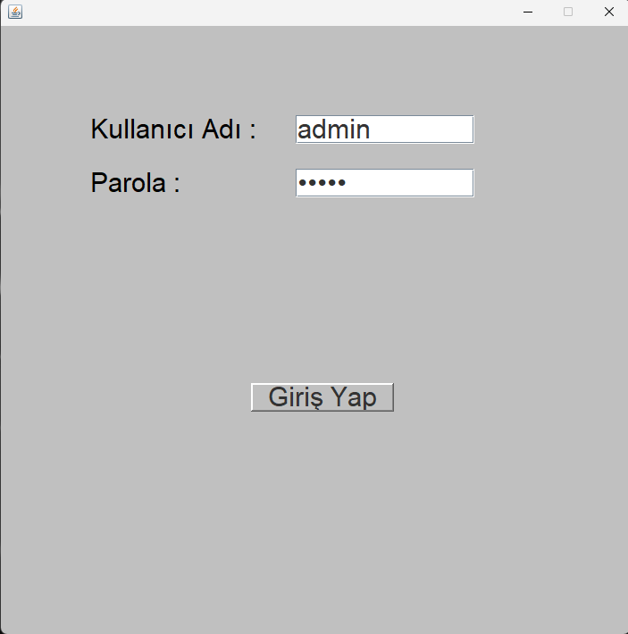
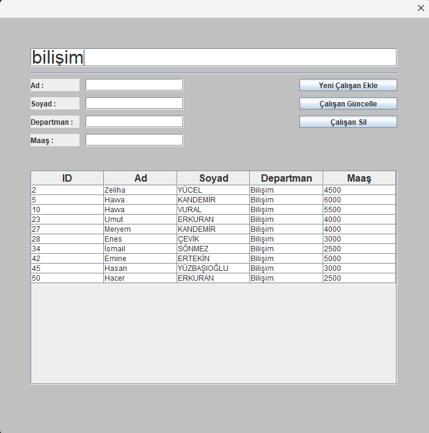

# 🏢 Çalışan Yönetim Sistemi (Employee Management System)

Bu proje, Java Swing kullanılarak geliştirilmiş, MySQL veritabanı ile entegre çalışan temel bir **CRUD (Create, Read, Update, Delete)** uygulamasıdır. Kullanıcıların çalışan bilgilerini yönetmesine, aramasına ve güncellenmesine olanak tanır.

## 🚀 Özellikler
* **Giriş Paneli:** Admin yetkilendirmesi ile güvenli giriş.
* **Çalışan Yönetimi:** Yeni çalışan ekleme, mevcut çalışanları güncelleme ve silme.
* **Dinamik Arama:** Tablo üzerinden anlık (real-time) çalışan arama filtresi.
* **Veritabanı Entegrasyonu:** JDBC üzerinden MySQL bağlantısı.
* **İşlem Güvenliği:** Veritabanı tutarlılığı için Transaction (Commit/Rollback) mantığına uygun yapı.

## 🛠 Kullanılan Teknolojiler
* **Dil:** Java
* **Arayüz:** Java Swing
* **Veritabanı:** MySQL
* **Kütüphane:** JDBC (Java Database Connectivity)

## 📋 Kurulum ve Çalıştırma

### 1. Veritabanı Hazırlığı
Yerel MySQL sunucunuzda `demo` adında bir veritabanı oluşturun ve aşağıdaki tabloları ekleyin:
```sql
CREATE TABLE adminler (
    username VARCHAR(50) PRIMARY KEY,
    password VARCHAR(50)
);

CREATE TABLE calisanlar (
    id INT AUTO_INCREMENT PRIMARY KEY,
    ad VARCHAR(50),
    soyad VARCHAR(50),
    departman VARCHAR(50),
    maas VARCHAR(20)
);

```


<div align="center">


## 📸 Uygulama Ekran Görüntüleri

### Admin Paneli


### Çalışan Paneli


</div>


